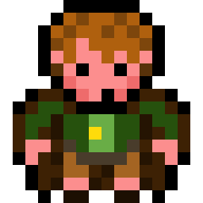
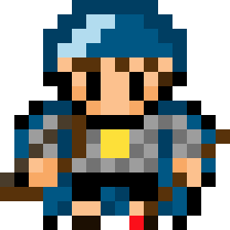

# Katalog Hobbajtów

Lista przydatnych komend do korzystania z języka Markdown jest dostępna pod adresem: https://www.markdownguide.org/cheat-sheet/

Obrazy Hobbajtów znajdują się w katalogu img.

Obrazy można wstawiać do dokumentów MD za pomocą znacznika HTML img:

### Hobbajt Staszek

Dawno temu, za siedmioma górami i za siedmioma lasami w Wolsztynie, a konkretnie, na wolsztyńskiej wyspie mieszkał Hobbajt Staszek.

---

### Hobbajt Zenek

Największym przyjacielem Hobbajta Staszka, był Hobbajt Zenek, z którym regularnie chodził na grzyby. 

---

